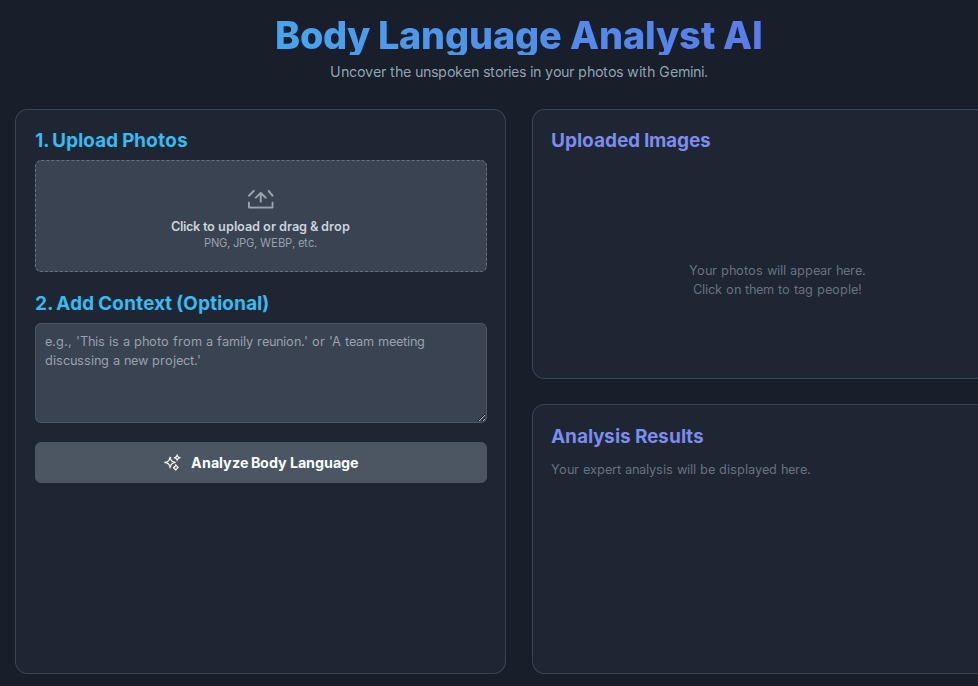

# Gemini Vibe Coding Project Index

[← Back to Master Index](https://github.com/danielrosehill/Github-Master-Index)

A collection of multimodal AI application prototypes built using Google AI Studio's build functionality. These are experimental "vibe-coded" starters exploring various AI capabilities including vision, audio, video, and text processing.

Feel free to fork, implement, or deploy any of these projects!

## Apps Index

### Audio Applications

#### Audio Speaker Editor

*Work in Progress*

**Screenshot:**

---

#### Echo Scribe

*Work in Progress*

**Screenshot:**

---

#### Playlist Curator

*Work in Progress*

**Screenshot:**

---

#### Voice Analyzer AI

Processes and analyzes audio input for voice characteristics, sentiment, and speech patterns.

**Repository:** [danielrosehill/Voice-Analyzer](https://github.com/danielrosehill/Voice-Analyzer)

**Screenshot:**

---

### Text Applications

#### AI Timesheet

*Work in Progress*

**Screenshot:**

---

#### Botify

*Work in Progress*

**Screenshot:**

---

#### Career Pivot AI

AI-powered career transition assistant that helps users explore new career paths through intelligent text analysis and search capabilities.

**Repository:** [danielrosehill/Career-Pivot-AI](https://github.com/danielrosehill/Career-Pivot-AI)

**Screenshot:**

---

#### Movie Recommendations

*Work in Progress*

**Screenshot:**

---

#### Notepad

*Work in Progress*

**Screenshot:**

---

#### Text to SSML Generator

Converts plain text to Speech Synthesis Markup Language (SSML) format for enhanced text-to-speech applications.

**Repository:** [danielrosehill/Text-To-SSML-Generator](https://github.com/danielrosehill/Text-To-SSML-Generator)

**Screenshot:**

---

#### Use Case Ideator

*Work in Progress*

**Screenshot:**

---

### Video Applications

#### Gemini Body Language Analyst

Analyzes body language and non-verbal communication from video inputs using Gemini's multimodal capabilities.

**Repository:** [danielrosehill/Gemini-Body-Language-Analyst](https://github.com/danielrosehill/Gemini-Body-Language-Analyst)

**Screenshot:**

---

### Vision Applications

#### AI Room Dimension Estimator

Analyzes images of rooms to estimate dimensions and spatial measurements using computer vision.

**Repository:** [danielrosehill/AI-Room-Dimension-Estimator](https://github.com/danielrosehill/AI-Room-Dimension-Estimator)

**Screenshot:**

---

#### Diagram Enhancer

*Work in Progress*

**Screenshot:**

---

#### Home Inventory

*Work in Progress*

**Screenshot:**

---

## About Google AI Studio

These projects were built using [Google AI Studio](https://ai.google.dev/aistudio), which provides an intuitive interface for rapid prototyping and experimentation with Google's AI models, including Gemini.

## Modality Legend

| Modality | Description | Use Case(s) |
|----------|-------------|-------------|
| Vision (Image to Text) | Analyzes images to extract information, measurements, or understanding through computer vision | Room dimension estimation, diagram analysis, object identification, visual inventory management |
| Audio to Text | Processes audio inputs to transcribe speech and analyze voice characteristics | Voice transcription, speaker identification, audio editing, voice pattern analysis |
| Audio Generation | Creates or curates audio content including music playlists | Music curation, playlist generation |
| Video (Video to Text) | Analyzes video content to extract insights about movement, behavior, and visual information | Body language analysis, gesture recognition, video content understanding |
| Text to Text | Processes and generates text for various applications | Career guidance, brainstorming, chatbots, note-taking, movie recommendations, timesheet management |
| Text to SSML | Converts plain text into Speech Synthesis Markup Language for enhanced text-to-speech | Voice application development, accessibility features, podcast production |
| Text + Search | Combines text processing with information retrieval capabilities | Career exploration, movie discovery, research assistance |

## Contributing

These are experimental prototypes. Feel free to:
- Fork and enhance
- Report issues
- Submit pull requests
- Deploy your own versions

## License

Each individual repository may have its own license. Please check the specific repository for licensing details.

## Author

**Daniel Rosehill**
- Website: [danielrosehill.com](https://danielrosehill.com)
- Email: public@danielrosehill.com

---

*Last updated: October 2024*
